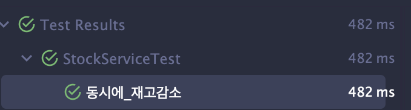
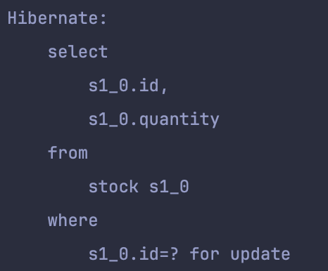

# 재고시스템으로 동시성 이슈 해결하기(1)
> **inflearn**: [재고시스템으로 알아보는 동시성이슈 해결방법
](https://www.inflearn.com/course/%EB%8F%99%EC%8B%9C%EC%84%B1%EC%9D%B4%EC%8A%88-%EC%9E%AC%EA%B3%A0%EC%8B%9C%EC%8A%A4%ED%85%9C#)
## Domain Model
`Stock.class`
```java
public class Stock {  
  
    @Id  
    @GeneratedValue(strategy = GenerationType.IDENTITY)  
    private Long id;  
    private Long quantity;  
  
    public void decrease(Long quantity) {  
        if (this.quantity - quantity < 0) throw new RuntimeException("재고는 0 미만이 될 수 없습니다.");  
        this.quantity -= quantity;  
    }  
}

public class StockService {  
  
    private final StockRepository stockRepository;  

	@Transactional
    public void decrease(Long id, Long quantity) {  
        Stock stock = stockRepository.findById(id).orElseThrow();  
        stock.decrease(quantity);  
    }  
}
```
- 재고의 수량을 감소할 수 있다.
- 재고의 수량을 감소할 때는 0 미만이 될 수 없다.

### 문제점
- 만약 동시의 100명의 사람이 같은 재고를 감소시키려고 한다면?
```java
@Test  
void 동시에_재고감소() {  
    int threadCount = 100;  
    ExecutorService executorService = Executors.newFixedThreadPool(32);  
    for (int i = 0; i < threadCount; i++) {  
        executorService.submit(() -> {  
            stockService.decrease(1L, 1L);  
        });  
    }    Stock stock = stockRepository.findById(1L).orElseThrow();  
    assertEquals(0, stock.getQuantity());  
}
```
위 테스트를 보면 재고를 1씩 100번 감소 했으니 결과는 0이라고 생각한다. 하지만..
```text
Expected :0
Actual   :86
```
남은 재고는 86으로 표시된다.
**원인**
- 여러 스레드가 동시에 서로 같은 자원을 수정하기 때문
- 스레드 1, 2 가 동시에 데이터베이스에 1번 재고를 조회
- 데이터베이스는 각각의 스레드에게 `Stock{id:1, quantity: 100}` 으로 전달
- 스레드 1과 2는 100에서 재고 감소를 수행
- 동시에 같은 자원을 수정하므로 재고 갱신이 누락됨
### 해결 방법 1: Synchronized
```java
public synchronized void decrease(Long id, Long quantity) {  
    Stock stock = stockRepository.findById(id).orElseThrow();  
    stock.decrease(quantity);  
	stockRepository.saveAndFlush(stock);
}
```
- `synchronized` 키워드는 프로세스 내에서 단 하나의 스레드만이 접근할 수 있도록 해주는 것
- 따라서 특정 스레드가 `decrease`를 수행하는 동안은 다른 스레드에서 접근할 수 없음
- `@Transactional` 어노테이션을 제거한 이유: `decrease`을 수행하고 커밋하기 전에 다른 트랜잭션에서 같은 재고를 가져올 수 있기때문..
- 따라서 완벽한 해결방법은 아니다.
  <div>
    
  </div>
- 테스트가 성공한 모습
- 위 방법은 **프로세스 내에서 단 하나의 스레드만 접근 할 수 있는 것을 제한**하는 것이다. 만약 여러 서버에서 운영되는 애플리케이션이라면? -> `synchronized`을 통해 접근을 제한해도 다른 서버에서는 접근할 수 있게된다.
### 해결 방법2: Database Lock
Database의 Lock을 통해 해결하는 방법
1. **비관적 락(Pessimistic lock)**
```java
public interface StockRepository extends JpaRepository<Stock, Long> {  
  
    @Lock(LockModeType.PESSIMISTIC_WRITE)  
    @Query("select s from Stock s where s.id=:id")  
    Optional<Stock> findByIdPessimisticLock(Long id);  
}
```
- JPA에서는 `@Lock` 어노테이션을 통해 락을 제어할 수 있음
  <div>
    
  </div>
- 쿼리를 확인해보면 ~for update 문이 추가된 것을 확인
2. **낙관적 락(Optimistic lock)**
   DB 단에서 Lock을 설정하는 것이 아닌, 애플리케이션 단에서 충돌 방지 로직을 추가하는 것
```java
@Lock(LockModeType.OPTIMISTIC)  
@Query("select s from Stock s where s.id=:id")  
Optional<Stock> findByIdOptimisticLock(Long id);
```
```java
@Component  
@RequiredArgsConstructor  
public class StockFacade {  
  
    private final StockService stockService;  
  
    public void decrease(Long id, Long quantity) throws InterruptedException {  
        while (true) {  
            try {  
                stockService.decrease(id, quantity);  
                break;  
            } catch (Exception e) {  
                Thread.sleep(50);  
            }  
        }  
  
    }  
}
```
- DB 에 직접 Lock 설정 하지 않아 성능 상 이점이 있지만, 별도의 충돌 처리 로직이 필요

