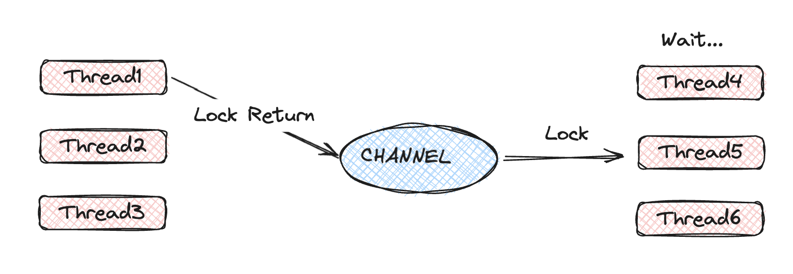

# 재고시스템으로 동시성 이슈 해결하기(2)
> **inflearn**: [재고시스템으로 알아보는 동시성이슈 해결방법
](https://www.inflearn.com/course/%EB%8F%99%EC%8B%9C%EC%84%B1%EC%9D%B4%EC%8A%88-%EC%9E%AC%EA%B3%A0%EC%8B%9C%EC%8A%A4%ED%85%9C#)
## Redis
- 인메모리 데이터베이스
- 단일 스레드로 동작
- 동시성 이슈를 처리할 때 사용하기도 함
  - `setNx`(set if not exist: 키가 없을 때만 set) 방식: 스핀락 -> 락 획득 하기위해 반복적으로 확인하는 방식(락 획득을 위한 재시도로직 필요)
  - pub/sub 기반: 중앙의 채널을 통해서 락 관리

## 실습
### Lettuce
- 스핀락(분산락)을 사용하는 방법
- 락 획득을 위해 래디스에 부하를 줄 수 있음
```java
package ooo.kkk.kinopio.entity.stock;  
  
import lombok.RequiredArgsConstructor;  
import org.springframework.data.redis.core.RedisTemplate;  
import org.springframework.stereotype.Component;  
  
import java.time.Duration;  
  
@Component  
@RequiredArgsConstructor  
public class RedisLockRepository {  
  
    private final RedisTemplate<String, String> redisTemplate;  
  
    public Boolean lock(Long key) {  
        return redisTemplate  
                .opsForValue()  
                .setIfAbsent(key.toString(), "lock", Duration.ofMillis(3_000));  
    }  
  
    public Boolean unlock(Long key) {  
        return redisTemplate.delete(key.toString());  
    }  
}
```
```java
package ooo.kkk.kinopio.service.stock;  
  
import lombok.RequiredArgsConstructor;  
import ooo.kkk.kinopio.entity.stock.RedisLockRepository;  
import org.springframework.stereotype.Service;  
import org.springframework.transaction.annotation.Transactional;  
  
@Service  
@RequiredArgsConstructor  
public class LettuceLockStockService {  
  
    private final RedisLockRepository repository;  
    private final StockService stockService;  
  
    @Transactional  
    public void decrease(Long id, Long quantity) throws InterruptedException {  
        while (!repository.lock(id)) {  
            Thread.sleep(100);  
        }  
        try {  
            stockService.decrease(id, quantity);  
        } finally {  
            repository.unlock(id);  
        }    }  
}
```
- `RedisLockRepository`:  락을 획득하고, 해제하는 로직만 존재
- `LettuceLockStockService`: 락을 획득할 때 까지 스핀하며, 락을 획득하고 로직 수행 후 락 해지
- 구현이 간단하다.
### Redisson
- pub/sub 방식
  <div>
    
  </div>
- 스레드가 락 사용후 반납하면, 중앙의 채널에서 락 사용할 수 있다고 스레드에게 전달한다.
- 대기중인 스레드는 중앙의 채널에서 락을 획득한다.
```java
package ooo.kkk.kinopio.service.stock;  
  
import lombok.RequiredArgsConstructor;  
import lombok.extern.slf4j.Slf4j;  
import org.redisson.api.RLock;  
import org.redisson.api.RedissonClient;  
import org.springframework.stereotype.Component;  
  
import java.util.concurrent.TimeUnit;  
  
@RequiredArgsConstructor  
@Component  
@Slf4j  
public class RedissonLockStockService {  
  
    private final RedissonClient redissonClient;  
    private final StockService stockService;  
  
    public void decrease(Long id, Long quantity) {
        RLock lock = redissonClient.getLock(id.toString());
        try {
            boolean available = lock.tryLock(10, 1, TimeUnit.SECONDS);
            if (!available) {
                log.info("lock 획득 실패");
                return;
            }
            stockService.decrease(id, quantity);
        } catch (InterruptedException e) {
            throw new RuntimeException(e);
        } finally {
            lock.unlock();
        }
    }
}
```
