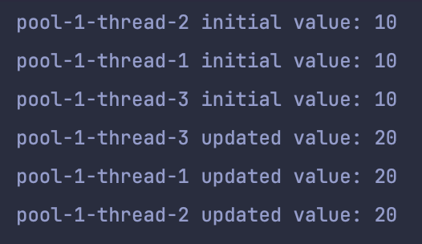

## 스레드로컬(ThreadLocal)
- 각각의 스레드가 독립적으로 변수에 접근할 수 있도록 하는 기능
- 일반적인 변수는 모든 스레드에서 공유되지만, 스레드 로컬을 통해 스레드마다 독립적인 변수를 가질 수 있음
- 멀티스레드 환경에서 상태를 안전하게 관리할 수 있음
    - 사용하지 않을때는 반드시 제거해 주어야함
## 예제 코드
```java
class ThreadLocalTest {  
  
    ExecutorService executorService = Executors.newFixedThreadPool(3);  
    private ThreadLocal<Integer> threadLocal = ThreadLocal.withInitial(() -> 10);  // 스레드 로컬 초기화
  
    @Test  
    void threadLocalTest() {  
        Runnable task = () -> {  
            String threadName = Thread.currentThread().getName();  
            Integer initialValue = threadLocal.get();  
            System.out.println(threadName + " initial value: " + initialValue);  
  
            threadLocal.set(initialValue + 10);  
            Integer updatedValue = threadLocal.get();  
  
            System.out.println(threadName + " updated value: " + updatedValue);  
        };  
        for (int i = 0; i < 3; i++) {  
            executorService.submit(task);  
        }    }  
}
```
출력 결과

- 스레드 로컬에 담긴 변수가 각각의 스레드에서 간섭없이 사용되고 있는 것을 확인할 수 있음

### 내부 로직
스레드 로컬은 내부적으로 `ThreadLocalMap`이라는 인스턴스를 통해 상태를 관리한다.
```java
public class ThreadLocal<T> {
	// ...
	
  public T get() {
    Thread t = Thread.currentThread();
    ThreadLocalMap map = getMap(t);
    
    if (map != null) {
      ThreadLocalMap.Entry e = map.getEntry(this);
      if (e != null) {
        @SuppressWarnings("unchecked")
        T result = (T) e.value;
        return result;
      }
    }
    return setInitialValue();
  }
  
    public void set(T value) {
        Thread t = Thread.currentThread();
        ThreadLocalMap map = getMap(t);
        
        if (map != null) {
            map.set(this, value);
        } else {
            createMap(t, value);
        }
    }
    
  public void remove() {
    ThreadLocalMap map = getMap(Thread.currentThread());

    if (map != null) {
      map.remove(this);
    }
  }
}
```
**get()**
- 스레드 로컬에 담긴 값을 가져오는 메서드
- 현재 스레드의 `ThreadLocalMap`에서 `Entry`를 가져와서, 값을 반환한다.
- 존재하지 않으면 초기 값을 반환한다.  

**set(T value)**
-  현재 스레드의 `ThreadLocalMap`의 유무에 따라 값을 설정하거나 `Map` 생성 후 값을 설정한다.

**remove()**
- 현재 스레드의 `ThreadLocalMap`을 가져와 값을 제거한다.

### Spring 에서의 ThreadLocal
1. 트랜잭션 매니저
   스레드 로컬을 사용해서 DB의 커넥션을 동기화를 해준다.(`TransactionSynchronizationManager.class`)
2. ContextHolder
   `SecurityContextHolder`, `LocaleContextHolder`와 같은 ContextHolder 클래스는 스레드 로컬을 통해 현재 요청을 수행하는 스레드의 Security나 Locale 정보를 확인할 수 있다.
### 주의점
스레드 로컬을 모두 사용하고 나면 `remove()`를 통해 스레드 로컬에 저장된 데이터를 반드시 제거해야한다. 스레드 풀을 사용하는 경우, 스레드 로컬에서 데이터를 저장하고 나서 스레드를 풀에 반환했을 때, 이후 스레드 풀에서 동일한 스레드를 꺼내서 사용하는 경우 이전에 저장된 데이터가 반환되어 버그가 발생할 수 있다.
