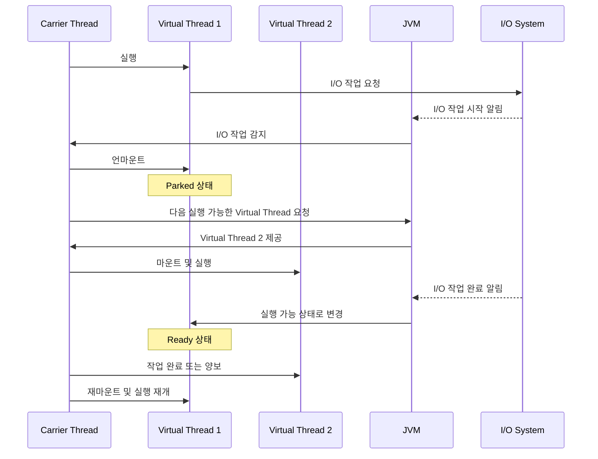

# 가상 스레드(Virtual Thread)
- JDK 21 부터 정식으로 도입된 Virtual Thread는 기존의 플랫폼 스레드와 다른 방식으로 경량화된 스레드를 제공
- 기존은 OS 스레드와 1:1 매핑하여 사용하였으나, 가상 스레드는 OS 스레드와 1:N 매핑하는 방식
- 가상 스레드는 매우 가볍고 수천, 수만 개의 스레드를 만들고 관리할 수 있음
## 기존 스레드와의 성능비교
가상 스레드는 I/O 작업에 대해 매우 뛰어난 성능을 보여준다.
```java
@RestController  
@RequiredArgsConstructor  
public class VirtualThreadsController {  
  
    private final RestClient restClient;  
  
    @GetMapping("/wait")  
    public String block() {  
        return this.restClient  
                .get()  
                .uri("https://httpbin.org/delay/5")  
                .retrieve()  
                .body(String.class);  
    }  
}
```
- `/wait` 요청은 5초가 소요된다.
```yaml
server:  
  tomcat:  
    threads:  
      max: 10
```
- 내장 톰캣의 스레드 개수는 10개로 설정
- 테스트 방법은 부하 테스트를 간단하게 CLI 로 할 수 있는 `hey`를 사용한다.
```sh
hey -n 60 -c 20 http://localhost:8080/wait
```
- 20개의 worker 가 60개의 요청을 보내는 테스트
```text
Summary:
  Total:	37.5520 secs
  Slowest:	16.6498 secs
  Fastest:	5.1987 secs
  Average:	6.8136 secs
  Requests/sec:	1.5978
```
- 모든 요청을 처리하는데 걸린 시간은 37초가 나왔다. 가상 스레드를 사용해서 다시 테스트를 진행해보자.
```yaml
spring:  
  threads:  
    virtual:  
      enabled: true
```

```text
Summary:
  Total:	17.2982 secs
  Slowest:	6.5741 secs
  Fastest:	5.1994 secs
  Average:	5.5983 secs
  Requests/sec:	3.4686
```
- 가상 스레드를 사용했을 때, 모든 요청을 처리하는데 걸린 시간은 17초가 나왔다. 약 2배 이상이 개선되었다.

> 가상 스레드를 사용하면, 별도의 추가 작업 없이 단순히 설정만 변경하는 것만으로도 성능 개선을 이뤄낼 수 있다.
## 동작 원리

- 캐리어 스레드 위에서 실행되고 있는 가상 스레드에서 I/O 작업을 시작하면 캐리어 스레드는 해당 가상 스레드를 언마운트한다.
- 그 후 캐리어 스레드는 다른 작업이 가능한 가상 스레드를 마운트하여 다른 작업을 수행할 수 있다.
- 하나의 캐리어 스레드로 여러 가상 스레드를 처리할 수 있어 OS 수준의 스레드 수를 최소화 하면서도 높은 동시 처리를 수행할 수 있다.
- 복잡한 비동기 프로그래밍 방식 대신에 기존 코드를 그대로 작성하면서 비동기의 이점을 얻을 수 있다.
## 참고자료
https://d2.naver.com/helloworld/1203723  
https://techblog.woowahan.com/15398/
