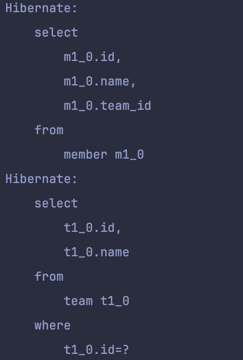
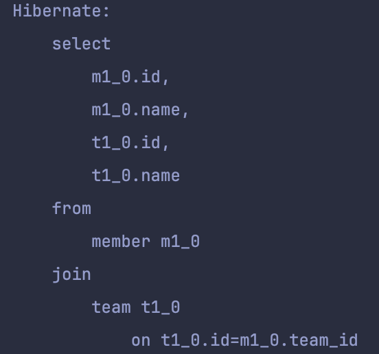
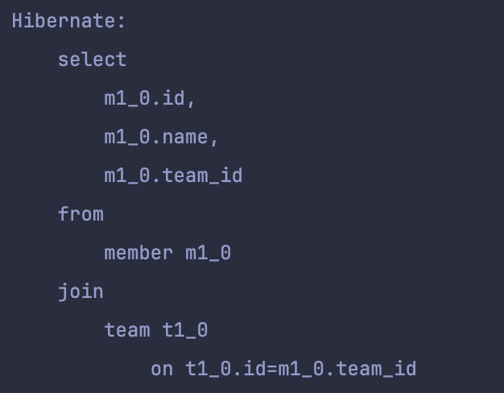

## Entity 예제
```java
@Entity  
@AllArgsConstructor  
@NoArgsConstructor  
@Getter  
public class Team {  
  
    @Id  
    @GeneratedValue(strategy = GenerationType.IDENTITY)  
    private Long id;  
    private String name;  
  
    @OneToMany(mappedBy = "team", cascade = CascadeType.ALL)  
    private List<Member> members = new ArrayList<>();  
  
    public void addMember(Member member) {  
        members.add(member);  
        member.setTeam(this);  
    }  
  
    public Team(Long id, String name) {  
        this.id = id;  
        this.name = name;  
    }  
}
```
```java
@Entity  
@NoArgsConstructor  
@Getter  
public class Member {  
  
    @Id  
    @GeneratedValue(strategy = GenerationType.IDENTITY)  
    private Long id;  
    private String name;  
  
    @Setter  
    @ManyToOne(fetch = FetchType.LAZY)  
    @JoinColumn(name = "teamId")  
    private Team team;  
  
    public Member(Long id, String name) {  
        this.id = id;  
        this.name = name;  
    }  
}
```
- Team 과 Member는 1:N 관계로 이루어져있다.
- 로딩 타입은 모두 LAZY로 설정한 상태이다.
## 1+N  문제
1+N은 한 번의 쿼리로 N 개의 엔티티를 조회 한 뒤, 각 엔티티와 관련된 엔티티를 조회하기 위해 N 개의 쿼리가 실행되는 현상
### 테스트
```java
@Test  
void test1() {  
    Team team = new Team(1L, "A팀");  
    Member member1 = new Member(1L, "A");  
    Member member2 = new Member(2L, "B");  
    Member member3 = new Member(3L, "C");  
  
    team.addMember(member1);  
    team.addMember(member2);  
    team.addMember(member3);  
  
    teamRepository.saveAndFlush(team);  
    entityManager.clear();  
  
    System.out.println("######");  
    List<Member> result = memberRepository.findAll();  
    for (Member member : result) {  
        System.out.println("member: " + member.getName() + "/" + member.getTeam().getName());  
    }    System.out.println("######");  
}
```
- 한 개의 팀, 세 명의 멤버
- 모든 멤버는 A팀에 속해있음
- 예상되는 쿼리 개수: 2
    - `memberRepository.findAll()` 에서 모든 멤버를 조회하는 쿼리 -> 1
    - `member` 엔티티의 `team`(A팀)을 Lazy Loading 할 때 발생되는 쿼리 -> N = 1
      <div>
        
      </div>
- 예상과 동일하게 총 2개의 쿼리가 발생했다.
-  `member` 엔티티는 3개가 조회됐지만, `team`는 한 번만 조회한 이유?
    - 모든 `member`가 A팀에 속하고 있으므로, 처음 A팀을 DB에서 쿼리하고 난 뒤에는 1차 캐시에서 A팀을 조회하기 때문에 DB 쿼리가 발생하지 않는다.
- 만약, `findAll()` 의 결과로 100명의 `member` 엔티티를 조회하고, 각각 다른 팀에 속해있다면?
    - 최대 1 + 100 개의 쿼리가 발생할 수 있음
- 1+N 문제로 인해 불필요한 쿼리가 발생하므로 성능이 저하될 수 있음
## 패치 조인(fetch join)
- 연관 관계에 속한 엔티티를 한번의 쿼리를 가져와 1+N 문제를 해결할 수 있는 기법
### 테스트
- Spring Data JPA에서 제공하는 `@Query` 어노테이션을 통해 쿼리를 작성함
```java
public interface MemberRepository extends JpaRepository<Member, Long> {  
  
  @Query(value = "select m from Member m join fetch m.team t")  
  List<Member> findAllWithFetchJoin();  
}
```
### 결과
- 예상되는 쿼리 개수: 1
    - 패치 조인으로 인해 연관된 엔티티들을 한번에 fetch 함
      <div>
        
      </div>
- 쿼리문을 보면 `select` 절에 연관된 엔티티를 모두 가져옴
### 일반 join과 차이점
```java
@Query(value = "select m from Member m join m.team t")  
List<Member> findAllWithJoin();
```
<div>
    
</div>
- 패치 조인과 동일하게 다른 엔티티와 join을 하지만, `select`절에서 `from`절에 해당되는 엔티티만 조회함
- 주로 `where`절에서 join 한 엔티티의 컬럼을 사용

```java
@Query(value = "select m from Member m join m.team t where t.name='개발팀'")  
List<Member> findByDevelopTeam(); // 개발팀에 속한 멤버들을 조회한다.
```
### 한계
**패치조인 + 페이징 시 경고가 발생한다.**
```java
@Query("select t from Team t join fetch t.members m")  
List<Team> findWithPagination(Pageable pageable);
```
- 컬렉션을 패치조인(일대다 관계의 리스트)할 때 페이징을 같이 사용하는 경우 아래와 같은 경고가 발생함
  `firstResult/maxResults specified with collection fetch; applying in memory`
- 위와 같은 경고 메세지 표시와 동시에 실제 DB 쿼리에는 페이징 관련 쿼리(`offset`, `limit`)가 존재하지 않음
- 메모리에 쿼리 결과를 모두 올려 놓은 뒤 애플리케이션 단에서 페이징 진행하기 때문에 메모리 사용량이 크게 증가할 수 있음
  해결방법
- `@BatchSize` 어노테이션이나 Hibernate 설정을 사용하여 연관된 엔티티를 배치로 로드한다.
- 필요한 데이터를 DTO를 사용하여 직접 Projection 한다. 